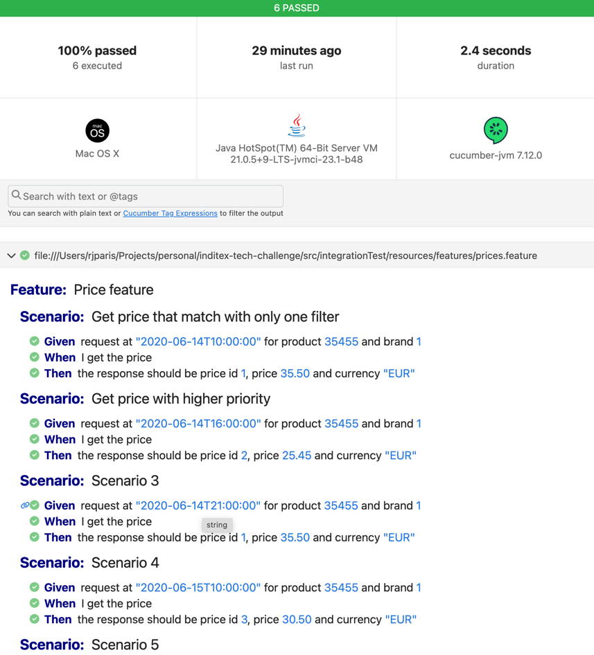
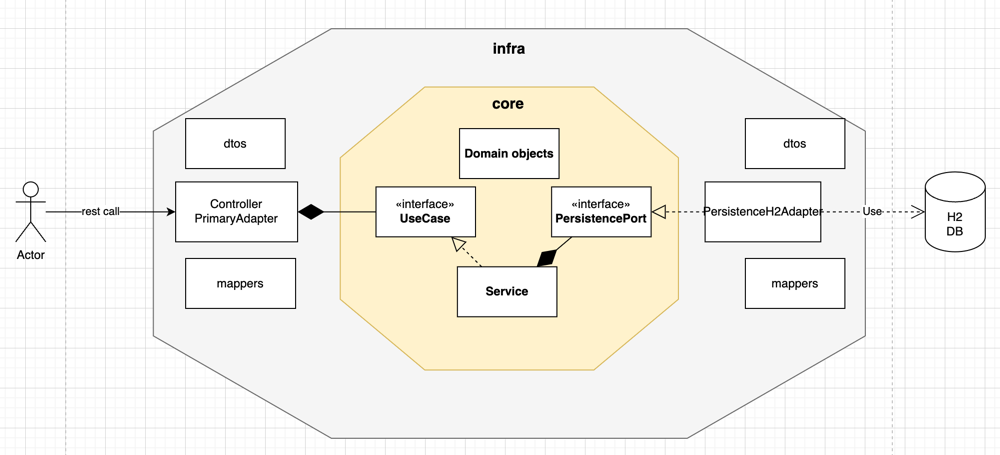

# Inditex code challenge

Author: Ramón José París González

### Technologies used

- Java 21 LTS.
- Gradle
- Spring Boot 3.4.1
- Spring Reactive (webflux, r2dbc)
- Cucumber for acceptance / integration tests
- JUnit5 and Mockito for unit testing
- H2 database
- Mapstruct for mapping objects through core and infra layers

### Execute the project

Make sure that you have installed Java 21 to run the project.

- Run the project

   ```bash
   ./gradlew clean bootRun
   ```

- Run unit tests

   ```bash
   ./gradlew test
   ```

- Run integration tests

   ```bash
   ./gradlew integrationTest
   ```
  This executes a cucumber CLI for running Integration Tests. It outputs a report that can be found at
  `target/cucumber-report.html`
  


- Build the project

   ```bash
   ./gradlew clean build
   ```
  
### Rest Call:
```bash
curl --location 'localhost:8080/v1/prices?datetime=2020-06-14T10:00:00&productId=35455&brandId=1'
```

Expected responses:
- 200 OK:
```JSON
{
  "productId": "35455",
  "brandId": "1",
  "startDate": "2020-06-14T00:00:00",
  "endDate": "2020-12-31T23:59:59",
  "priceId": "1",
  "price": 35.5,
  "currency": "EUR"
}
```

- 400 Bad request:
```text
400 BAD_REQUEST "Required query parameter 'brandId' is not present."
```

- 404 Not found
- 500 Internal server error


### Architecture decisions

- **Hexagonal Architecture principles**:
    - Separation of `infrastructure` and `core` layer
    - Usage of primary and secondary adapter as well as UseCases and Ports for communication with infrastructure
    - Creation of domain object and mappings for not coupling Infrastructure objects with Domain objects





- **Criteria pattern for database filtering**:
    - Thinking in the scalability of the solution, I implemented a Criteria pattern for filtering in the database, which
      allow us to maintain better, scale better and follow Open/Closed principle from SOLID


- **Auto import of schema and data in H2 DB**:
    - Usage of Spring for creating schemas and inserting data in H2 DB for project and integration test executions


- **Spring Reactive**:
  - Usage of Spring Reactive. With special focus in non-blocking behaviors.
  - Usage of `Webflux` for handling `Monos` and `Fluxes`
  - Usage of `r2dbc` for non blocking database operations


- **Implementation of a ControllerAdvicer**: 
  - Making sure that there is no unexpected error trace that could give insights of technologies used in the API


- **Developed using TDD principles**


- **Clean Code mindset 🤓**
  